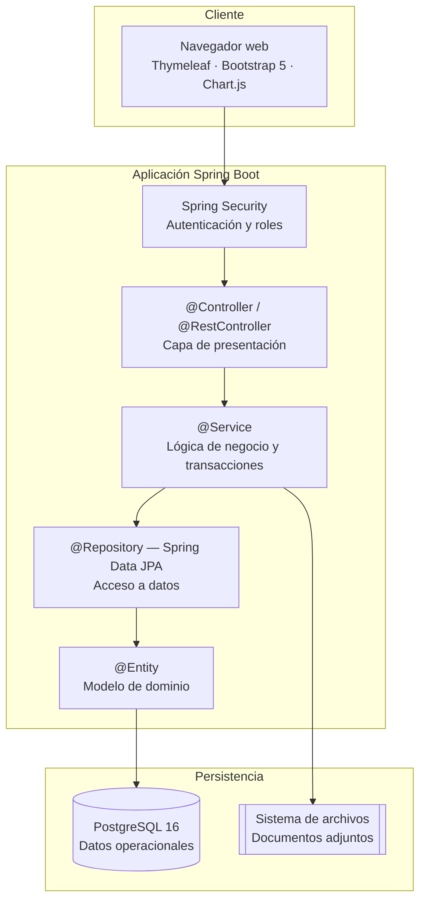

# Mira — Sistema de gestión y trazabilidad de equipos de geomensura

> Proyecto de título · Capstone APT122 · Ingeniería en Informática · Duoc UC · 2026

---

## 1. Descripción

**Mira** es un sistema web que permite a una empresa comercializadora y arrendadora de instrumental de geomensura saber, en todo momento, **dónde está cada uno de sus equipos, en qué estado se encuentra y a quién fue entregado**.

### ¿A quién va dirigido?

Una empresa que vende y arrienda instrumental de geomensura (estaciones totales, GPS RTK, drones, niveles y accesorios) a empresas mineras, constructoras y consultoras de topografía. Los usuarios directos son:

| Usuario | Uso principal |
|---|---|
| Encargado de bodega | Registrar equipos, traslados, despachos y retornos |
| Vendedor | Consultar disponibilidad, registrar ventas y arriendos, agendar capacitaciones |
| Administración | Adjuntar y consultar la documentación de cada operación |
| Jefatura | Revisar indicadores de inventario y utilización |

### ¿Qué problema resuelve?

Hoy el inventario se administra en planillas Excel distribuidas entre varias bodegas. El registro es genérico —se contabilizan cantidades, no unidades— por lo que la empresa no puede determinar en qué bodega está un equipo específico, si se encuentra arrendado, a qué cliente fue entregado ni cuándo debe retornar.

El problema de fondo no es la falta de registro, sino que **la herramienta no representa la naturaleza del negocio**: una planilla describe un estado fijo, mientras que los equipos cambian de estado y de ubicación de forma permanente.

Esto se traduce en:

- Búsquedas manuales y llamados entre bodegas para ubicar un equipo.
- Demoras en responder consultas de disponibilidad, con pérdida de oportunidades comerciales.
- Arriendos con retorno vencido que no se detectan, inmovilizando activos de alto valor.
- Documentación (OC, guías de despacho, facturas) desvinculada del equipo al que corresponde.
- Ausencia de indicadores para decidir nuevas adquisiciones.

**Mira** reemplaza la planilla por un registro donde cada equipo es una **unidad única identificada por su número de serie**, con estado, ubicación e historial trazables, sobre el cual se gestionan las operaciones de venta y arriendo, sus capacitaciones y su documentación asociada.

---

## 2. Tecnologías utilizadas

| Capa | Tecnología | Motivo de la elección |
|---|---|---|
| Lenguaje | **Java 21 (LTS)** | Versión de soporte extendido y estándar de la industria nacional |
| Framework | **Spring Boot 4.1** | Línea con soporte OSS vigente hasta julio de 2027 |
| Persistencia | Spring Data JPA + Hibernate | Repositorios declarativos, sin implementación manual de DAOs |
| Seguridad | Spring Security | Autenticación y autorización por rol |
| Migraciones | Flyway | Versionado del esquema de base de datos junto al código |
| Vistas | Thymeleaf + Bootstrap 5 | Renderizado en el servidor: un solo proyecto y un solo modelo mental |
| Gráficos | Chart.js | Visualización de indicadores en el panel |
| Base de datos | PostgreSQL 16 | Integridad referencial y soporte transaccional para el control de estados |
| Utilidades | Lombok · MapStruct | Reducción de código repetitivo en entidades y DTOs |
| Build | Maven (wrapper incluido) | Construcción reproducible sin instalación previa |
| Pruebas | JUnit 5 · Mockito · Testcontainers | Pruebas unitarias y de integración contra PostgreSQL real |
| Contenedores | Docker + Docker Compose | Entorno reproducible entre los integrantes |
| Control de versiones | Git + GitHub | Ramas por funcionalidad y revisión por *pull request* |
| Despliegue | VM Oracle Cloud (Always Free) | Memoria suficiente para la JVM, sin costo de operación |

> **Sobre la elección del stack.** Se evaluaron alternativas de desarrollo más rápido para este tipo de solución. Se optó por Java con Spring Boot considerando su adecuación a una aplicación de gestión con alto componente transaccional y el objetivo formativo del equipo de desarrollar competencias en el entorno tecnológico de mayor demanda en el mercado nacional. Para compensar el mayor volumen de código, se descartó una interfaz de página única (SPA) en favor de renderizado en el servidor con Thymeleaf.
>
> Todas las tecnologías empleadas son de código abierto con licencias permisivas (Apache 2.0, MIT, BSD, PostgreSQL License). El sistema no incorpora componentes con licenciamiento por usuario ni costos de licencia en producción.

---

## 3. Instrucciones para ejecutar el proyecto localmente

### Requisitos previos

- **JDK 21** o superior ([Eclipse Temurin](https://adoptium.net) recomendado)
- **PostgreSQL 16** (o Docker, si se usa la Opción B)
- **Git**

> No es necesario instalar Maven: el repositorio incluye el *Maven Wrapper* (`mvnw`).

### Opción A — Entorno local

```bash
# 1. Clonar el repositorio
git clone https://github.com/<usuario>/mira.git
cd mira

# 2. Crear la base de datos
createdb mira        # o mediante pgAdmin

# 3. Configurar las variables de entorno
cp .env.example .env
# Editar .env con las credenciales de la base de datos local

# 4. Compilar y ejecutar las pruebas
./mvnw clean verify          # Windows: mvnw.cmd clean verify

# 5. Levantar la aplicación
./mvnw spring-boot:run
```

Flyway aplica automáticamente las migraciones al iniciar. La aplicación queda disponible en `http://localhost:8080`.

**Usuario inicial** (creado por la migración `V2__datos_iniciales.sql`):

```
usuario:    admin@mira.cl
contraseña: admin123          ← cambiar en el primer inicio de sesión
```

### Opción B — Docker Compose

Levanta la aplicación y PostgreSQL en conjunto, sin instalar nada más que Docker:

```bash
git clone https://github.com/<usuario>/mira.git
cd mira
cp .env.example .env
docker compose up --build
```

### Variables de entorno

| Variable | Descripción | Ejemplo |
|---|---|---|
| `DB_URL` | URL JDBC de la base de datos | `jdbc:postgresql://localhost:5432/mira` |
| `DB_USER` | Usuario de la base de datos | `postgres` |
| `DB_PASSWORD` | Contraseña | `postgres` |
| `SPRING_PROFILES_ACTIVE` | Perfil activo | `dev` |
| `APP_UPLOAD_DIR` | Carpeta de documentos adjuntos | `./uploads` |

### Comandos útiles

```bash
./mvnw test                      # Solo pruebas unitarias
./mvnw clean package             # Genera el .jar ejecutable
java -jar target/mira-0.0.1-SNAPSHOT.jar
```

---

## 4. Integrantes del equipo

| Integrante | Rol |
|---|---|
| Joaquín Romero | Líder de proyecto · Modelo de datos, entidades JPA y capa de servicios |
| Gonzalo Arenas | Controladores, vistas Thymeleaf, panel de indicadores y documentación |

Ambos integrantes participan en el levantamiento de requerimientos con la contraparte, en las pruebas y en la validación de los entregables.

---

## 5. Metodología de trabajo

El equipo trabaja bajo un enfoque **ágil basado en Scrum**, adaptado al calendario de la asignatura.

- **Backlog por épicas.** El alcance se organiza en 9 épicas dimensionadas mediante *Poker Planning*, expresadas en puntos de función (100 PF en total) y distribuidas entre las semanas 5 y 14.
- **Iteraciones quincenales.** Cada iteración cierra con una funcionalidad demostrable.
- **Tablero Kanban en GitHub Projects**, con las columnas `Backlog → En progreso → En revisión → Hecho`.
- **Reuniones de sincronización** dos veces por semana entre los integrantes, y reuniones de validación con la contraparte en los hitos de monitoreo (semanas 6, 11 y 17).
- **Flujo de trabajo en Git:** rama `main` estable, ramas `feature/<epica>-<descripcion>` por funcionalidad e integración mediante *pull request* con revisión del otro integrante.
- **Convención de commits:** `feat:`, `fix:`, `docs:`, `test:`, `refactor:`.

### Planificación por fases

| Fase | Semanas | Contenido |
|---|---|---|
| Fase 1 | 1 – 4 | Definición del proyecto, levantamiento de requerimientos y modelado |
| Fase 2 | 5 – 15 | Desarrollo iterativo de las épicas y pruebas |
| Fase 3 | 16 – 18 | Cierre, documentación final y presentación |

---

## 6. Arquitectura de la solución

Aplicación web monolítica **estructurada en capas**, siguiendo el patrón habitual de Spring Boot. Se optó por un monolito modular por sobre una arquitectura de microservicios dado el tamaño del equipo y el plazo disponible: la separación por paquetes mantiene el orden del código sin incorporar la complejidad operacional de servicios distribuidos.



### Estructura de paquetes

```
cl.duoc.mira
├── config          → Configuración de Spring Security, Web y beans
├── usuarios        → Usuarios, roles y permisos
├── inventario      → Equipos, categorías, estados, bodegas y traslados
├── operaciones     → Ventas, arriendos, disponibilidad y retornos
├── capacitaciones  → Agendamiento y asignación de técnicos
├── documentos      → Órdenes de compra, guías de despacho y facturas
├── indicadores     → Panel de indicadores y alertas
└── common          → Excepciones, auditoría y utilidades compartidas
```

Cada paquete de dominio contiene sus propias clases `entity`, `repository`, `service`, `controller` y `dto`, de modo que la funcionalidad queda agrupada por área de negocio y no por tipo técnico.

### Decisiones de diseño

1. **El equipo es la entidad central.** Cada unidad física corresponde a un registro propio identificado por número de serie, y no a una cantidad dentro de una categoría. Es la decisión que hace posible la trazabilidad.
2. **El estado del equipo se deriva de sus movimientos.** Todo cambio de ubicación o de situación genera un registro de movimiento, de modo que el historial es reconstruible y auditable.
3. **La disponibilidad es una consulta calculada**, no un campo almacenado: se determina a partir del estado del equipo y de los arriendos vigentes, evitando inconsistencias.
4. **Las operaciones que alteran el estado de un equipo son transaccionales** (`@Transactional` en la capa de servicio), de modo que un arriendo nunca queda registrado sin que el equipo cambie de estado, ni viceversa.
5. **Los documentos se vinculan a la operación**, y a través de ella al equipo, permitiendo reconstruir el historial documental de cualquier activo.

### Alcance del producto mínimo viable

**Incluido:** control de acceso por rol · inventario por número de serie · bodegas y traslados · disponibilidad consolidada · ventas · arriendos con control de retorno · capacitaciones · documentos adjuntos · panel de indicadores.

**Fuera de alcance (trabajo futuro):** integración con el SII y emisión de documentos tributarios electrónicos · cruce automático entre orden de compra, guía y factura · aplicación móvil nativa · módulo de calibración certificada · integración con software contable.

---

## 7. Estado del proyecto

🚧 En desarrollo — Fase 2 (semanas 5 a 15).

El avance por épica puede consultarse en el tablero del repositorio.
