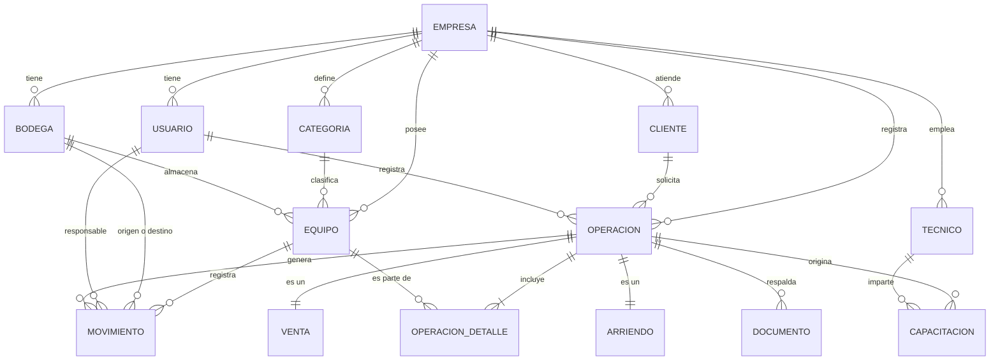

# Modelo de datos

Modelo entidad-relación y diccionario de datos de Mira.

> **Elaborado sin la reunión de levantamiento.** Las decisiones marcadas como *supuesto*
> en la sección 6 deben confirmarse con la contraparte apenas sea posible. Están tomadas
> hacia el lado conservador: prefieren un modelo que soporte más casos antes que uno que
> haya que migrar después.

---

## 1. Decisiones de diseño

Estas decisiones explican el modelo. Si algo del diagrama no se entiende, la respuesta
está acá.

### 1.1 El equipo es una unidad individual

Cada instrumento físico es una fila en `equipo`, identificada por su número de serie. No
se modela como cantidad dentro de una categoría. Es la decisión que hace posible toda la
trazabilidad.

### 1.2 Toda entidad de negocio pertenece a una empresa

Cada tabla lleva `empresa_id` y las claves únicas del negocio lo son **por empresa**:
`(empresa_id, numero_serie)`, `(empresa_id, rut)`. Hoy existe una sola empresa cargada,
pero incorporarlo después obligaría a migrar todos los datos.

### 1.3 El estado del equipo se deriva de sus movimientos

`movimiento` es la fuente de verdad: registra cada ingreso, traslado, salida y retorno.
El campo `equipo.estado` es una proyección del último movimiento, que se mantiene por
conveniencia de consulta.

**Regla obligatoria: nunca se cambia `equipo.estado` sin insertar el `movimiento`
correspondiente, y ambas escrituras van en la misma transacción.**

### 1.4 Una operación agrupa varios equipos

`operacion` es la entidad padre de `venta` y `arriendo`, y se relaciona con los equipos a
través de `operacion_detalle`.

Se descartó el modelo de un equipo por operación. En la realidad del negocio, un cliente
arrienda tres equipos en un mismo contrato y una guía de despacho ampara todos. Agregar la
línea de detalle ahora cuesta una tabla y un bucle en el servicio; agregarla después
obligaría a migrar las operaciones existentes y a reescribir la validación de
disponibilidad.

### 1.5 Herencia entre venta y arriendo

`operacion` es la tabla base y `venta` y `arriendo` son tablas hijas, con estrategia
`JOINED` de JPA. Comparten cliente, fecha, usuario y documentos; se diferencian en que el
arriendo tiene fechas de retorno.

Gracias a esto, `documento` y `capacitacion` apuntan a `operacion` y funcionan igual para
ambos tipos, sin campos duplicados ni nulos.

### 1.6 Lo que no se almacena porque se calcula

| Concepto | Cómo se obtiene |
|---|---|
| Disponibilidad de un equipo | `estado = 'DISPONIBLE'` y sin arriendo vigente |
| Estado del arriendo (vigente, vencido, cerrado) | Comparando `fecha_retorno_comprometida`, `fecha_retorno_real` y la fecha actual |
| Días de atraso | Diferencia entre hoy y `fecha_retorno_comprometida` |
| Nivel de utilización | Días arrendado sobre días del periodo |
| Total de una operación | Suma de `operacion_detalle.valor_unitario` |

Almacenar cualquiera de estos abriría la puerta a que el dato se desincronice de la
realidad, que es justamente el problema que el proyecto resuelve.

### 1.7 Los roles son un enumerado, no una tabla

Los tres roles están definidos en el alcance y no cambian: administrador, encargado de
bodega y vendedor. Una tabla de roles con permisos configurables es funcionalidad que no
se comprometió.

---

## 2. Diagrama entidad-relación

**Cómo leer las cardinalidades.** `||--o{` significa uno a muchos, donde el lado "muchos"
puede estar vacío. `||--|{` significa uno a muchos con al menos uno: una operación debe
tener al menos un detalle. `||--||` es la relación de herencia entre `operacion` y sus
tablas hijas.

---

## 3. Enumerados

**`estado_equipo`**

| Valor | Significado |
|---|---|
| `DISPONIBLE` | En bodega, puede comprometerse |
| `ARRENDADO` | En poder de un cliente |
| `EN_TRANSITO` | En traslado entre bodegas |
| `EN_MANTENCION` | Fuera de servicio temporalmente |
| `VENDIDO` | Salida definitiva del inventario |

**`tipo_movimiento`**

| Valor | Cambia el estado a |
|---|---|
| `INGRESO` | `DISPONIBLE` |
| `TRASLADO_SALIDA` | `EN_TRANSITO` |
| `TRASLADO_LLEGADA` | `DISPONIBLE` |
| `SALIDA_ARRIENDO` | `ARRENDADO` |
| `RETORNO_ARRIENDO` | `DISPONIBLE` |
| `SALIDA_VENTA` | `VENDIDO` |
| `ENTRADA_MANTENCION` | `EN_MANTENCION` |
| `SALIDA_MANTENCION` | `DISPONIBLE` |

**`rol_usuario`**: `ADMINISTRADOR`, `ENCARGADO_BODEGA`, `VENDEDOR`

**`tipo_operacion`**: `VENTA`, `ARRIENDO` (discriminador de la herencia)

**`tipo_documento`**: `ORDEN_COMPRA`, `GUIA_DESPACHO`, `FACTURA`

**`estado_capacitacion`**: `PROGRAMADA`, `REALIZADA`, `CANCELADA`

---

## 4. Diccionario de datos

Todas las tablas incluyen los campos de auditoría `creado_por`, `creado_en`,
`modificado_por` y `modificado_en`, gestionados automáticamente por Spring Data JPA. No se
repiten en cada tabla.

### empresa

| Campo | Tipo | Nulo | Descripción |
|---|---|---|---|
| `id` | BIGSERIAL | No | Clave primaria |
| `rut` | VARCHAR(12) | No | RUT de la empresa, único |
| `razon_social` | VARCHAR(200) | No | Razón social |
| `nombre_fantasia` | VARCHAR(200) | Sí | Nombre comercial |
| `activa` | BOOLEAN | No | Por defecto verdadero |

### usuario

| Campo | Tipo | Nulo | Descripción |
|---|---|---|---|
| `id` | BIGSERIAL | No | Clave primaria |
| `empresa_id` | BIGINT | No | Empresa a la que pertenece |
| `nombre` | VARCHAR(100) | No | Nombre |
| `apellido` | VARCHAR(100) | No | Apellido |
| `email` | VARCHAR(150) | No | Credencial de acceso, único global |
| `password_hash` | VARCHAR(100) | No | Hash BCrypt. Nunca la contraseña en claro |
| `rol` | VARCHAR(30) | No | Enumerado `rol_usuario` |
| `activo` | BOOLEAN | No | Un usuario inactivo no puede iniciar sesión |

El correo es único a nivel global, no por empresa, para que el inicio de sesión no requiera
elegir la empresa.

### bodega

| Campo | Tipo | Nulo | Descripción |
|---|---|---|---|
| `id` | BIGSERIAL | No | Clave primaria |
| `empresa_id` | BIGINT | No | Empresa propietaria |
| `nombre` | VARCHAR(100) | No | Nombre identificador |
| `direccion` | VARCHAR(200) | Sí | Dirección física |
| `comuna` | VARCHAR(100) | Sí | Comuna |
| `activa` | BOOLEAN | No | Una bodega inactiva no admite nuevos equipos |

Única por `(empresa_id, nombre)`.

### categoria

| Campo | Tipo | Nulo | Descripción |
|---|---|---|---|
| `id` | BIGSERIAL | No | Clave primaria |
| `empresa_id` | BIGINT | No | Empresa propietaria |
| `nombre` | VARCHAR(100) | No | Estación total, GPS RTK, dron, nivel |
| `descripcion` | VARCHAR(300) | Sí | Detalle de la categoría |
| `requiere_capacitacion` | BOOLEAN | No | Si es verdadero, el sistema sugiere agendar capacitación al operar |
| `activa` | BOOLEAN | No | Por defecto verdadero |

`requiere_capacitacion` es lo que conecta el inventario con la épica 007.

### equipo

| Campo | Tipo | Nulo | Descripción |
|---|---|---|---|
| `id` | BIGSERIAL | No | Clave primaria |
| `empresa_id` | BIGINT | No | Empresa propietaria |
| `categoria_id` | BIGINT | No | Categoría del instrumento |
| `bodega_id` | BIGINT | No | Bodega de asignación. Se mantiene aunque el equipo esté arrendado |
| `numero_serie` | VARCHAR(80) | No | Identificador del fabricante |
| `marca` | VARCHAR(80) | No | Marca |
| `modelo` | VARCHAR(80) | No | Modelo |
| `estado` | VARCHAR(20) | No | Enumerado `estado_equipo` |
| `fecha_adquisicion` | DATE | Sí | Fecha de compra |
| `valor_adquisicion` | NUMERIC(12,2) | Sí | Valor de compra |
| `tarifa_diaria` | NUMERIC(12,2) | Sí | Tarifa de arriendo sugerida por día |
| `observaciones` | TEXT | Sí | Notas |
| `activo` | BOOLEAN | No | Baja lógica. Un equipo nunca se elimina físicamente |

**Único por `(empresa_id, numero_serie)`.** Índices por `(empresa_id, estado)` y
`(empresa_id, categoria_id)` para la consulta de disponibilidad.

`bodega_id` no se anula cuando el equipo sale a arriendo: indica dónde pertenece y adónde
se espera que retorne. Dónde está físicamente lo dice el estado.

### movimiento

| Campo | Tipo | Nulo | Descripción |
|---|---|---|---|
| `id` | BIGSERIAL | No | Clave primaria |
| `empresa_id` | BIGINT | No | Empresa propietaria |
| `equipo_id` | BIGINT | No | Equipo afectado |
| `tipo` | VARCHAR(30) | No | Enumerado `tipo_movimiento` |
| `fecha` | TIMESTAMP | No | Momento del movimiento |
| `bodega_origen_id` | BIGINT | Sí | Nulo en un ingreso inicial |
| `bodega_destino_id` | BIGINT | Sí | Nulo en una salida a cliente |
| `operacion_id` | BIGINT | Sí | Operación que lo origina, si corresponde |
| `usuario_id` | BIGINT | No | Responsable del registro |
| `observacion` | VARCHAR(300) | Sí | Nota |

Índice por `(equipo_id, fecha)` para reconstruir el historial.

**Esta tabla no se modifica ni se elimina nunca.** Es el registro histórico: si un
movimiento fue un error, se registra el movimiento inverso.

### cliente

| Campo | Tipo | Nulo | Descripción |
|---|---|---|---|
| `id` | BIGSERIAL | No | Clave primaria |
| `empresa_id` | BIGINT | No | Empresa que lo atiende |
| `rut` | VARCHAR(12) | No | RUT del cliente |
| `razon_social` | VARCHAR(200) | No | Razón social |
| `giro` | VARCHAR(150) | Sí | Giro comercial |
| `direccion` | VARCHAR(200) | Sí | Dirección |
| `comuna` | VARCHAR(100) | Sí | Comuna |
| `contacto_nombre` | VARCHAR(150) | Sí | Persona de contacto |
| `contacto_email` | VARCHAR(150) | Sí | Correo de contacto |
| `contacto_telefono` | VARCHAR(30) | Sí | Teléfono |
| `activo` | BOOLEAN | No | Baja lógica |

Único por `(empresa_id, rut)`.

### operacion

Tabla base de la herencia.

| Campo | Tipo | Nulo | Descripción |
|---|---|---|---|
| `id` | BIGSERIAL | No | Clave primaria |
| `empresa_id` | BIGINT | No | Empresa |
| `tipo` | VARCHAR(20) | No | Discriminador: `VENTA` o `ARRIENDO` |
| `cliente_id` | BIGINT | No | Cliente |
| `usuario_id` | BIGINT | No | Quien registra la operación |
| `fecha` | DATE | No | Fecha de la operación |
| `observaciones` | TEXT | Sí | Notas |

### venta

| Campo | Tipo | Nulo | Descripción |
|---|---|---|---|
| `id` | BIGINT | No | Clave primaria y foránea a `operacion` |
| `numero_orden_compra` | VARCHAR(50) | Sí | Referencia informada por el cliente |

### arriendo

| Campo | Tipo | Nulo | Descripción |
|---|---|---|---|
| `id` | BIGINT | No | Clave primaria y foránea a `operacion` |
| `fecha_inicio` | DATE | No | Inicio del arriendo |
| `fecha_retorno_comprometida` | DATE | No | Fecha pactada de devolución |
| `numero_orden_compra` | VARCHAR(50) | Sí | Referencia informada por el cliente |

Índice por `fecha_retorno_comprometida` para el cálculo de alertas.

No existe un campo de estado del arriendo: se deriva de las fechas y de los retornos
registrados en el detalle.

### operacion_detalle

| Campo | Tipo | Nulo | Descripción |
|---|---|---|---|
| `id` | BIGSERIAL | No | Clave primaria |
| `operacion_id` | BIGINT | No | Operación a la que pertenece |
| `equipo_id` | BIGINT | No | Equipo comprometido |
| `valor_unitario` | NUMERIC(12,2) | No | Precio de venta, o tarifa diaria del arriendo |
| `fecha_retorno_real` | DATE | Sí | Solo arriendos. Nulo mientras no retorne |
| `observacion` | VARCHAR(300) | Sí | Nota de la línea |

**Único por `(operacion_id, equipo_id)`:** un equipo no puede repetirse dentro de la misma
operación.

El retorno se registra por línea, porque un cliente puede devolver un equipo y quedarse con
otro del mismo arriendo.

### tecnico

| Campo | Tipo | Nulo | Descripción |
|---|---|---|---|
| `id` | BIGSERIAL | No | Clave primaria |
| `empresa_id` | BIGINT | No | Empresa |
| `nombre` | VARCHAR(100) | No | Nombre |
| `apellido` | VARCHAR(100) | No | Apellido |
| `email` | VARCHAR(150) | Sí | Correo |
| `telefono` | VARCHAR(30) | Sí | Teléfono |
| `activo` | BOOLEAN | No | Baja lógica |

Se modela aparte de `usuario` porque un técnico que imparte capacitaciones no
necesariamente tiene acceso al sistema.

### capacitacion

| Campo | Tipo | Nulo | Descripción |
|---|---|---|---|
| `id` | BIGSERIAL | No | Clave primaria |
| `empresa_id` | BIGINT | No | Empresa |
| `operacion_id` | BIGINT | No | Operación que la origina |
| `tecnico_id` | BIGINT | No | Técnico asignado |
| `fecha_programada` | TIMESTAMP | No | Fecha y hora agendada |
| `fecha_realizada` | TIMESTAMP | Sí | Fecha y hora efectiva |
| `lugar` | VARCHAR(200) | Sí | Dependencias del cliente, terreno u oficina |
| `estado` | VARCHAR(20) | No | Enumerado `estado_capacitacion` |
| `observaciones` | TEXT | Sí | Notas |

Índice por `(tecnico_id, fecha_programada)` para detectar choques de agenda.

### documento

| Campo | Tipo | Nulo | Descripción |
|---|---|---|---|
| `id` | BIGSERIAL | No | Clave primaria |
| `empresa_id` | BIGINT | No | Empresa |
| `operacion_id` | BIGINT | No | Operación que respalda |
| `tipo` | VARCHAR(20) | No | Enumerado `tipo_documento` |
| `numero_folio` | VARCHAR(50) | Sí | Folio o número del documento |
| `fecha_emision` | DATE | Sí | Fecha de emisión |
| `nombre_archivo` | VARCHAR(255) | No | Nombre original del archivo |
| `ruta_archivo` | VARCHAR(500) | No | Ruta relativa dentro del almacenamiento |
| `content_type` | VARCHAR(100) | No | Tipo MIME |
| `tamano_bytes` | BIGINT | No | Tamaño |

El archivo binario no se guarda en la base de datos, solo su referencia.

---

## 5. Reglas de integridad

Reglas que el modelo no puede expresar por sí solo y que viven en la capa de servicios.
Cada una tiene su caso de prueba en `docs/10-casos-de-prueba.md`.

1. Un equipo solo puede incluirse en una operación de arriendo si su estado es
   `DISPONIBLE` y no tiene un arriendo vigente.
2. Registrar una operación crea la operación, sus detalles, cambia el estado de cada equipo
   y registra un movimiento por equipo. **Todo dentro de una transacción.**
3. Registrar el retorno de una línea de arriendo escribe `fecha_retorno_real`, devuelve el
   equipo a `DISPONIBLE` y registra el movimiento `RETORNO_ARRIENDO`.
4. Un equipo `VENDIDO` no vuelve a estar disponible por ninguna vía.
5. Toda consulta filtra por `empresa_id`, incluidas las que buscan por identificador.
6. Los equipos y clientes se dan de baja lógicamente. No se eliminan físicamente.
7. La tabla `movimiento` es de solo inserción.

---

## 6. Supuestos por validar con la contraparte

Como no se realizó la reunión de levantamiento, estas decisiones se tomaron con criterio
propio. **Confírmenlas apenas puedan.** Ninguna es cara de cambiar hoy; algunas sí lo son
después de tener datos cargados.

| # | Supuesto | Riesgo si es incorrecto |
|---|---|---|
| 1 | Una operación puede incluir varios equipos | Bajo. El modelo ya lo soporta; si siempre es uno, sobra capacidad |
| 2 | El retorno de un arriendo puede ser parcial, equipo por equipo | Bajo. Igual que el anterior |
| 3 | La tarifa de arriendo es diaria | **Medio.** Si cobran por semana o por mes, cambia el cálculo y el campo |
| 4 | Los equipos no se sub-arriendan ni se prestan entre bodegas sin registro | Bajo |
| 5 | Un cliente es una empresa, no una persona natural | Bajo. El RUT sirve para ambas |
| 6 | El técnico que capacita no requiere acceso al sistema | Bajo. Si lo requiere, se vincula a `usuario` |
| 7 | Los accesorios se registran como equipos con su propia serie | **Medio.** Si manejan accesorios sin serie, hace falta un modelo de consumibles |
| 8 | No se controla el estado de conservación al retornar | **Medio.** Si necesitan registrar daños, falta un campo o una entidad de revisión |
| 9 | Un equipo pertenece siempre a una bodega, aun estando arrendado | Bajo |
| 10 | No se requiere cotización previa a la operación | **Alto si es falso.** Una cotización sería una entidad y una épica nuevas, fuera del alcance actual |

Los supuestos 3, 7, 8 y 10 son los que conviene preguntar primero. Si no logran la reunión,
la Eve podría confirmarlos, porque trabaja ahí.

---

## 7. Nota sobre las migraciones

La primera migración `V1__esquema_inicial.sql` crea todo este esquema. La segunda,
`V2__datos_iniciales.sql`, carga la empresa, el usuario administrador y las categorías
básicas.

**Una vez aplicadas, no se editan.** Cualquier ajuste posterior, incluso corregir un tipo
de dato, va en una migración nueva.
